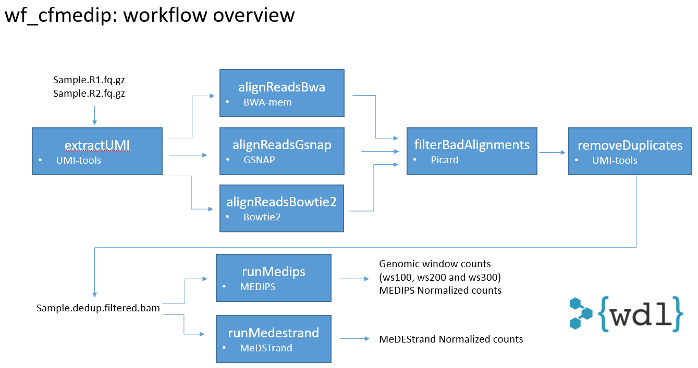

# wf-cfMeDIP
Workflow for cfMeDIP data analysis using Docker

## User configuration: IMPORTANT!!! READ ME FIRST!!!

**Do not use sudo to execute `docker` commands**, instead, add an existing user to the _docker_ group `sudo usermod -aG docker harrycallahan`, which grants this user permissions to execute the `docker` command (i.e. `docker image ls`, `docker run`, `docker build`, etc).

To execute `docker run [docker_image]` in a development server, the user must pass its user and group IDs (in numeric format) by using the following `docker` command: `docker run --rm -u $(id -u):$(id -g) -ti [docker_image]`. As a consequence, the container processes belong to a user that is known by the host, allowing things like reading and writing data located in network shares. This user does not exist in the container, and the command prompt shows `I have no name!`, but processes are triggered under the valid UID nonetheless.

## Download pre-built image
A pre-built Docker image is hosted in Docker Hub (private repository, login required). First, execute `docker login`, and then `docker pull albertojleon/wf_cfmedip` to create a mirror image in the local registry.

## Build image locally
Download repository (currently private repo, Github user and password will be requested):
`git clone https://github.com/translational-genomics-laboratory/wf-cfMeDIP.git`

At this point, changes can be made to the `Dockerfile` or to the `wf_main.R` script.

Build the image (can take more than an hour): 
`docker build -t wf_cfmedip:latest wf-cfMeDIP/`

