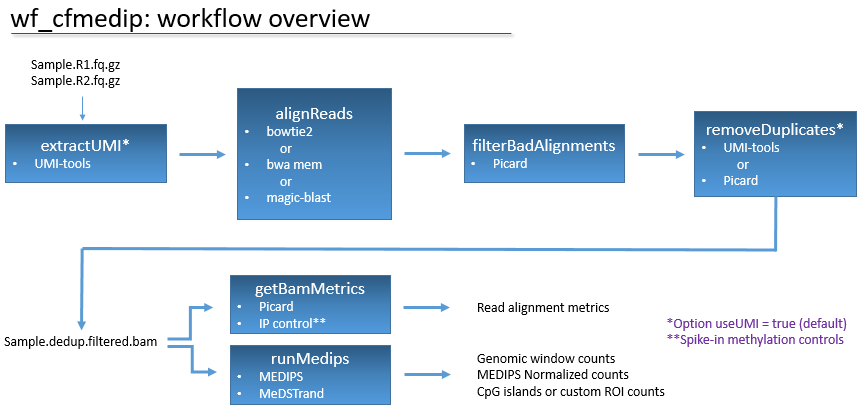

# wf-cfMeDIP
Workflow for cfMeDIP data analysis using Docker and WDL



## Installation
**Option 1:**
Download the pre-built image that is hosted in Docker Hub by executing `docker pull oicrgsi/wf_cfmedip`.

**Option 2:**
If you do not have root privileges, or are working on a HPC cluster, consider downloading [
Singularity](https://sylabs.io/docs/) and downloading the pre-built image hosted in Docker Hub by executing: `singularity pull docker://oicrgsi/wf_cfmedip`

**Option 3:**
Download the contents of the repository by executing `git clone https://github.com/oicr-gsi/wf-cfMeDIP.git`, and then build the Docker image by running `docker build -t oicr-gsi/wf_cfmedip:latest wf-cfMeDIP/`; this process can take more than two hours.

## Workflow parameters
| Parameter  | Required / Optional | Description |
| --- | --- | --- |
| --R1  | Required | fastq file mate 1 (.gz allowed) |
| --R2  | Required | fastq file mate 2 (.gz allowed) |
| --aligner | Required | [bowtie2] or [bwa] (using bwa mem) or [magic-blast] |
| --index | Required | genomic index pre-built for the selected aligner |
| --fasta | Required | reference genomic sequence in fasta format |
| --outputPath | Required | output folder |
| --sampleName | Optional | labels files. If not provided, the filename from --R1 is used |
| --patternUMI | Optional | [UMI-tools extract] --bc-pattern parameter. <br>Default "NNNNN" |
| --patternUMI2 | Optional | [UMI-tools extract] --bc-pattern2 parameter. <br>Default = "NNNNN" |
| --seqMeth | Optional | Name of sequence to be used as methylated control. <br>Default = "F19K16" |
| --seqUmeth | Optional | Name of sequence to be used as unmethylated control. <br>Default = "F24B22" |
| --useUMI | Optional | Do reads contain UMIs? Default = true |
| --newReadLen | Optional | After UMI extraction, runs [fastp] --max_len1 and --max_len2. <br>Default = -1 (trimming disabled) |
| --windowSize | Optional | MeDIPs window size parameter. Default = 200 |
| --threads | Optional | Number of threads used by the aligner. Default = 4 |
| --useMedestrand | Optional | Perform MeDEStrand analysis? 'true' or 'false' (default = false) |
| --ROIFile | Optional | File with regions of interest for MeDIPs. Default = "/data/UCSC-hg38-CpG.bed" |

[bowtie2]: https://github.com/BenLangmead/bowtie2/blob/master/README.md
[bwa]: https://github.com/lh3/bwa/blob/master/README.md
[magic-blast]: https://ncbi.github.io/magicblast/
[UMI-tools extract]: https://umi-tools.readthedocs.io/en/latest/reference/extract.html
[fastp]: https://github.com/OpenGene/fastp/blob/master/README.md#all-options

## Deep and shallow sequencing runs (read trimming)
Some laboratories perform a preliminary shallow sequencing run for QC purposes (i.e. MiSeq run) prior performing full depth sequencing (i.e. NovaSeq). If necessary, the option --newReadLen adds a trimming step to reduce the size of the reads from the QC run and ensure that the metrics of the deep and shallow runs are comparable. 

## Example
File structure containing the elements required by the workflow:
```
|storage
	|cromwell
	|MyStudy
		|fastq
			|sample001_R1.fastq.gz
			|sample001_R2.fastq.gz
		|output
			|sample001
				|run_inside_container.sh
		|index
			|bowtie2
				|ucsc.hg38_F19K16_F24B22
					|ucsc.hg38_F19K16_F24B22
			|fasta
				|ucsc.hg38_F19K16_F24B22.fasta
```

Contents of the file `/storage/MyStudy/sample001/run_inside_container.sh`:
```
python3 /workflow/launch_cromwell.py \
	--R1 /data/fastq/sample001_R1_001.fastq.gz \
	--R2 /data/fastq/sample001_R2_001.fastq.gz \
	--aligner bowtie2 \
	--indexPath /data/index/bowtie2/ucsc.hg38_F19K16_F24B22/ucsc.hg38_F19K16_F24B22 \
	--fastaFile /data/index/fasta/ucsc.hg38_F19K16_F24B22.fasta \
	--outputPath /data/output/sample001
```

The following command "turns on" the Docker container and orders it to execute the instructions that are contained in the file `run_inside_container.sh`:
```
docker run --rm -it -u $(id -u):$(id -g) \
	-v /storage/cromwell:/cromwell \
	-v /storage/MyStudy:/data \
	oicrgsi/wf_cfmedip /data/output/sample001/run_inside_container.sh
```

The equivalent Singularity command to run the pipeline and execute the instructions contained in the file `run_inside_container.sh`:  
```
singularity run \
  -B /pathway/to/storage/cromwell/:/cromwell \ 
  -B /pathway/to/MyStudy:/data \
  oicrgsi/wf_cfmedip /data/output/sample001/run_inside_container.sh \
  wf_cfmedip_latest.sif
```

**Do not use sudo to execute `docker` commands**, instead, add an existing user to the _docker_ group `sudo usermod -aG docker myuser`, which grants this user permissions to execute the `docker` command (i.e. `docker image ls`, `docker run`, `docker build`, etc).

## Credits

Developed by Alberto León at [Ontario Institute for Cancer Research / Genome Sequence Informatics team](https://oicr.on.ca/)

[](https://oicr.on.ca)
