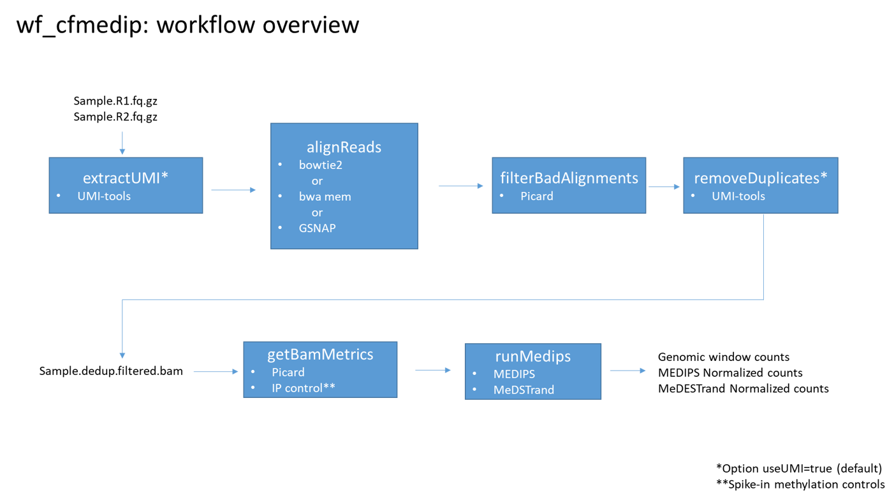

# wf-cfMeDIP
Workflow for cfMeDIP data analysis using Docker and WDL



## Installation
**Option 1:**
Download the pre-built image that is hosted in Docker Hub by executiong `docker pull oicrgsi/wf_cfmedip`.

**Option 2:**
Download the contents of the repository by executing `git clone https://github.com/oicr-gsi/wf-cfMeDIP.git`, and then build the Docker image by running `docker build -t oicr-gsi/wf_cfmedip:latest wf-cfMeDIP/`; this process can take more than two hours.

## Workflow parameters
| Parrameter  | Required/Optional | Description |
| --- | --- | --- |
| --R1  | Required | fastq file mate 1 (.gz allowed) |
| --R2  | Required | fastq file mate 2 (.gz allowed) |
| --aligner | Required | bowtie2 or bwa or gsnap |
| --index | Required | genomic index pre-built for the selected aligner |
| --fasta | Required | reference genomic sequence in fasta format |
| --outputPath | Required | output folder |
| --sampleName | Optional | labels files. If not provided, the filename from --R1 is used |
| --patternUMI | Optional | UMI-tools patternUMI parameter. Default "NNNNN" |
| --patternUMI2 | Optional | UMI-tools patternUMI2 parameter. Default = "NNNNN" |
| --seqMeth | Optional | Name of sequence to be used as methylated control. Default = "F19K16" |
| --seqUmeth | Optional | Name of sequence to be used as unmethylated control. Default = "F24B22" |
| --useUMI | Optional | Do reads contain UMIs? Default = true |
| --windowSize | Optional | MeDIPs window size parameter. Default = 200 |

## Example
File structure containing the elements required by the workflow:
```
|storage
	|cromwell
	|MyStudy
		|fastq
			|sample001_R1.fastq.gz
			|sample001_R2.fastq.gz
		|output
			|sample001
				|run_inside_container.sh
		|index
			|bowtie2
				|ucsc.hg38_F19K16_F24B22
					|ucsc.hg38_F19K16_F24B22
			|fasta
				|ucsc.hg38_F19K16_F24B22.fasta
```

Contents of the file `/storage/MyStudy/sample001/run_inside_container.sh`:
```
python3 /workflow/launch_cromwell.py \
	--R1 /data/fastq/sample001_R1_001.fastq.gz \
	--R2 /data/fastq/sample001_R2_001.fastq.gz \
	--aligner bowtie2 \
	--indexPath /data/index/bowtie2/ucsc.hg38_F19K16_F24B22/ucsc.hg38_F19K16_F24B22 \
	--fastaFile /data/index/fasta/ucsc.hg38_F19K16_F24B22.fasta \
	--outputPath /data/output/sample001
```

The following command "turns on" the Docker container and orders it to execute the instructions that are contained in the file `run_inside_container.sh`:
```
docker run --rm -it -u $(id -u):$(id -g) \
	-v /storage/cromwell:/cromwell \
	-v /storage/MyStudy:/data \
	oicrgsi/wf_cfmedip /data/output/sample001/run_inside_container.sh
```

**Do not use sudo to execute `docker` commands**, instead, add an existing user to the _docker_ group `sudo usermod -aG docker myuser`, which grants this user permissions to execute the `docker` command (i.e. `docker image ls`, `docker run`, `docker build`, etc).


